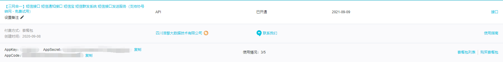
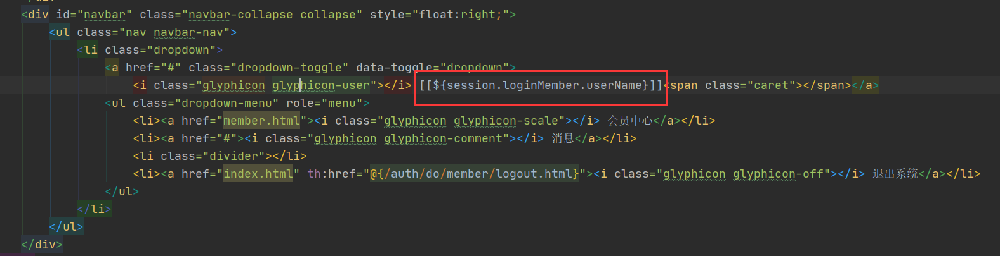
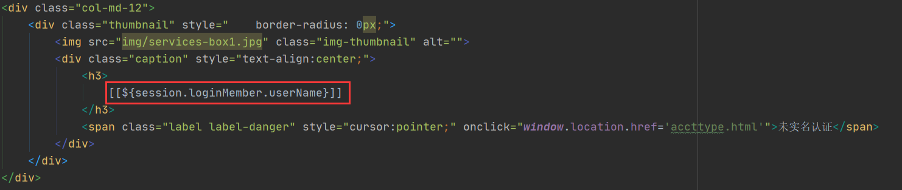

# 会员注册

## **目标**

​	实现通过手机验证码来完成会员账号的注册。


## **实现**

### 1、在阿里云市场购买短信验证码



这里选择的版本不需要引入额外的依赖，通过JDK1.8直接可以使用

店铺中给出的示例代码：

```java
package com.aliyun.test;

import java.io.BufferedReader;
import java.io.IOException;
import java.io.InputStream;
import java.io.InputStreamReader;
import java.net.HttpURLConnection;
import java.net.MalformedURLException;
import java.net.URL;
import java.net.UnknownHostException;
import java.util.List;
import java.util.Map;

public class Tools {
    public static void main(String[] args) {
        String host = "http://smsmsgs.market.alicloudapi.com";  // 【1】请求地址 支持http 和 https 及 WEBSOCKET
        String path = "/smsmsgs"; // 【2】后缀
        String appcode = "你自己的AppCode"; // 【3】开通服务后 买家中心-查看AppCode
        String param = "123456";  // 【4】请求参数，详见文档描述
        String phone = "18030939917";  //  【4】请求参数，详见文档描述
        String sign = "175622";   //  【4】请求参数，详见文档描述
        String skin = "1";  //  【4】请求参数，详见文档描述
        String urlSend = host + path + "?param=" + param +"&phone="+phone +"&sign="+sign +"&skin="+skin;  // 【5】拼接请求链接
        try {
            URL url = new URL(urlSend);
            HttpURLConnection httpURLCon = (HttpURLConnection) url.openConnection();
            httpURLCon.setRequestProperty("Authorization", "APPCODE " + appcode);// 格式Authorization:APPCODE (中间是英文空格)
            int httpCode = httpURLCon.getResponseCode();
            if (httpCode == 200) {
                String json = read(httpURLCon.getInputStream());
                System.out.println("正常请求计费(其他均不计费)");
                System.out.println("获取返回的json:");
                System.out.print(json);
            } else {
                Map<String, List<String>> map = httpURLCon.getHeaderFields();
                String error = map.get("X-Ca-Error-Message").get(0);
                if (httpCode == 400 && error.equals("Invalid AppCode `not exists`")) {
                    System.out.println("AppCode错误 ");
                } else if (httpCode == 400 && error.equals("Invalid Url")) {
                    System.out.println("请求的 Method、Path 或者环境错误");
                } else if (httpCode == 400 && error.equals("Invalid Param Location")) {
                    System.out.println("参数错误");
                } else if (httpCode == 403 && error.equals("Unauthorized")) {
                    System.out.println("服务未被授权（或URL和Path不正确）");
                } else if (httpCode == 403 && error.equals("Quota Exhausted")) {
                    System.out.println("套餐包次数用完 ");
                } else {
                    System.out.println("参数名错误 或 其他错误");
                    System.out.println(error);
                }
            }

        } catch (MalformedURLException e) {
            System.out.println("URL格式错误");
        } catch (UnknownHostException e) {
            System.out.println("URL地址错误");
        } catch (Exception e) {
            // 打开注释查看详细报错异常信息
            // e.printStackTrace();
        }

    }

    /*
     * 读取返回结果
     */
    private static String read(InputStream is) throws IOException {
        StringBuffer sb = new StringBuffer();
        BufferedReader br = new BufferedReader(new InputStreamReader(is));
        String line = null;
        while ((line = br.readLine()) != null) {
            line = new String(line.getBytes(), "utf-8");
            sb.append(line);
        }
        br.close();
        return sb.toString();
    }
}
```

### 2、将该API在项目中使用

 

前端点击“发送验证码”按钮：

```html
<!-- 给手机号的输入框加name=phoneNum -->
<div class="form-group has-success has-feedback">
    <input type="text" name="phoneNum" class="form-control" id="inputSuccess4" placeholder="请输入手机号" style="margin-top:10px;">
    <span class="glyphicon glyphicon glyphicon-earphone form-control-feedback"></span>
</div>

<!-- 按钮加上id=sendBtn -->
<button type="button" id="sendBtn" class="btn btn-lg btn-success btn-block"> 获取验证码</button>

<!-- sendBtn的单击响应函数 -->
<script type="text/javascript">
        $(function () {
            // sendBtn 发送验证码按钮的单击响应函数
            $("#sendBtn").click(function () {

                // 1、获取接收短信的手机号
                let phoneNum = $.trim($("[name=phoneNum]").val());

                // 2、发送 ajax 请求获取验证码
                $.ajax({
                    url: "auth/member/send/short/message.json",
                    type: "post",
                    data: {
                        phoneNum: phoneNum
                    },
                    dataType: "json",
                    success: function (response) {

                        let result = response.result;

                        if (result == "SUCCESS") {
                            layer.msg("发送成功！");
                        }

                        if (result == "FAILED") {
                            layer.msg("发送失败！请再试一次！");
                        }

                    },
                    error: function (response) {
                        layer.msg(response.status + " " + "服务器出现错，请重试！！");
                    }
                });
            });
        });
</script>
```


发送验证码的方法：

通过工具方法，调用api发送验证码，但是我是先将验证码存入 redis，以防如果 redis 宕机保存出错显示给用户错误信息，但是信息已经发出的局面

```java
@Autowired
RedisRemoteService redisRemoteService;

// 自动注入对象，对象的属性从application.yml文件中获取
@Autowired
ShortMessageProperties shortMessageProperties;

/**
 * 将验证码发送至 phoneNum 手机
 * @param phoneNum
 * @return
 */
@ResponseBody
@PostMapping("/auth/member/send/short/message.json")
public ResultEntity<String> sendMessage(@RequestParam("phoneNum") String phoneNum) {

    // 1、先将验证码存入 redis，以免 redis 宕机导致收到短信但提示不可用
    // ① 生成验证码
    StringBuilder stringBuilder = new StringBuilder();
    for (int i = 0; i < 4; i++) {
        int random = (int) (Math.random() * 10);
        stringBuilder.append(random);
    }
    String code = stringBuilder.toString();

    // 2、将验证码存入 redis
    // ① 拼接一个用于在 redis 中存储数据的 key
    String key = CrowdConstant.REDIS_CODE_PREFIX + phoneNum;
    ResultEntity<String> saveCodeResultEntity = redisRemoteService.setRedisKeyValueRemoteWithTimeOut(key, code, 15, TimeUnit.MINUTES);

    // 判断结果
    if (ResultEntity.SUCCESS.equals(saveCodeResultEntity.getResult())) {
        // 如果成功将验证码保存到 redis，调用远程服务发送短信验证码到 phoneNum 手机
        ResultEntity<String> sendMessageResultEntity = CrowdUtil.sendCodeByShortMessage(
                shortMessageProperties.getHost(),
                shortMessageProperties.getPath(),
                shortMessageProperties.getMethod(),
                phoneNum,
                code,
                shortMessageProperties.getAppCode(),
                shortMessageProperties.getSmsSignId(),
                shortMessageProperties.getTemplateId()
        );

        // 3、判断短信的发送结果
        if (ResultEntity.SUCCESS.equals(sendMessageResultEntity.getResult())) {
            return ResultEntity.successWithoutData();
        }else {
            return sendMessageResultEntity;
        }
    }else {
        return saveCodeResultEntity;
    }
}
```

工具方法**sendCodeByShortMessage(...)**：

```java
/**
 *
 * @param host  短信接口调用的 URL 地址
 * @param path  具体发送短信功能的地址
 * @param method    请求方式
 * @param phoneNum  接收验证码的手机号
 * @param code      验证码
 * @param appCode   用来调用第三方短信 API 的 AppCode
 * @param smsSignId 签名编号
 * @param templateId    模板编号
 * @return
 */
public static ResultEntity<String> sendCodeByShortMessage(

        String host,

        String path,

        String method,

        String phoneNum,

        String code,

        String appCode,

        String smsSignId,

        String templateId) {


    Map<String, String> headers = new HashMap<String, String>();
    // 最后在header中的格式(中间是英文空格)为Authorization:APPCODE 83359fd73fe94948385f570e3c139105
    headers.put("Authorization", "APPCODE " + appCode);

    // 封装其他的参数
    Map<String, String> querys = new HashMap<String, String>();

    // 收短信的手机号
    querys.put("mobile", phoneNum);

    // 要发送的验证码，也就是模板中会变化的部分
    querys.put("param", "**code**:"+code+",**minute**:5");

    // 签名编号
    querys.put("smsSignId", smsSignId);

    // 模板编号
    querys.put("templateId", templateId);
    Map<String, String> bodys = new HashMap<String, String>();


    try {
        /**
         * 重要提示如下:
         * HttpUtils请从
         * https://github.com/aliyun/api-gateway-demo-sign-java/blob/master/src/main/java/com/aliyun/api/gateway/demo/util/HttpUtils.java
         * 下载
         *
         * 相应的依赖请参照
         * https://github.com/aliyun/api-gateway-demo-sign-java/blob/master/pom.xml
         */
        HttpResponse response = HttpUtils.doPost(host, path, method, headers, querys, bodys);

        // 状态码：200正常；400 URL 无效；401 appCode 错误；403 次数用完；500 API 网关错误
        StatusLine statusLine = response.getStatusLine();
        // 响应状态码
        int statusCode = statusLine.getStatusCode();

        // 状态或出错原因
        String reasonPhrase = statusLine.getReasonPhrase();

        if(statusCode == 200) {
            return ResultEntity.successWithData(code);
        }

        return ResultEntity.failed(reasonPhrase);
    } catch (Exception e) {
        e.printStackTrace();
        return ResultEntity.failed(e.getMessage());
    }
}
```


ShortMessageProperties：

```java
@AllArgsConstructor
@NoArgsConstructor
@Data
// 加入ioc容器
@Component
// 给类设置在配置文件中设置时的前缀为“short.message”
@ConfigurationProperties(prefix = "short.message")
public class ShortMessageProperties {
    private String host;
    private String path;
    private String appCode;
    private String sign;
    private String skin;
}
```

在application.yml中配置：

```yml
short:
  message:
    host: http://smsmsgs.market.alicloudapi.com
    path: /smsmsgs
    appCode: d0c8d0bf07cec8ac09bec086f0a8  # 这里就是购买得到的appCode
    sign: 1
    skin: 2
```

**注意**：想要使用application.yml/properties文件来配置类，需要加入依赖：

```xml
<dependency>
    <groupId>org.springframework.boot</groupId>
    <artifactId>spring-boot-configuration-processor</artifactId>
</dependency>
```


验证码获取完成后，进行注册操作：


前端的表单，添加action、method，给所有input标签设置对应的name，并且添加一个p标签，用于显示注册出错时的信息：

```html
<form action="auth/do/member/register" method="post" class="form-signin" role="form">
    <h2 class="form-signin-heading"><i class="glyphicon glyphicon-log-in"></i> 用户注册</h2>
    <p class="text-danger" th:text="${message}">这里显示从请求域里得到的消息</p>
    <div class="form-group has-success has-feedback">
        <input name="loginacct" type="text" class="form-control" id="inputSuccess4" placeholder="请输入登录账号" autofocus>
        <span class="glyphicon glyphicon-user form-control-feedback"></span>
    </div>
    <div class="form-group has-success has-feedback">
        <input name="userpswd" type="text" class="form-control" id="inputSuccess4" placeholder="请输入登录密码" style="margin-top:10px;">
        <span class="glyphicon glyphicon-lock form-control-feedback"></span>
    </div>
    <div class="form-group has-success has-feedback">
        <input name="username" type="text" class="form-control" id="inputSuccess4" placeholder="请输入用户昵称" style="margin-top:10px;">
        <span class="glyphicon glyphicon-lock form-control-feedback"></span>
    </div>
    <div class="form-group has-success has-feedback">
        <input name="email" type="text" class="form-control" id="inputSuccess4" placeholder="请输入邮箱地址" style="margin-top:10px;">
        <span class="glyphicon glyphicon glyphicon-envelope form-control-feedback"></span>
    </div>
    <div class="form-group has-success has-feedback">
        <input name="phoneNum" type="text" class="form-control" id="inputSuccess4" placeholder="请输入手机号" style="margin-top:10px;">
        <span class="glyphicon glyphicon glyphicon-earphone form-control-feedback"></span>
    </div>
    <div class="form-group has-success has-feedback">
        <input name="code" type="text" class="form-control" id="inputSuccess4" placeholder="请输入验证码" style="margin-top:10px;">
        <span class="glyphicon glyphicon glyphicon-comment form-control-feedback"></span>
    </div>
    <button id="sendBtn" type="button" class="btn btn-lg btn-success btn-block"> 获取验证码</button>
    <button class="btn btn-lg btn-success btn-block">注册</button>
</form>
```

编写后端的方法：

```java
@Autowired
private RedisRemoteService redisRemoteService;

@Autowired
private MySQLRemoteService mySQLRemoteService;
/**
 * 进行用注册的操作
 * 涉及到验证码验证，用户名查重，redis 验证码删除，用户保存操作
 * @param memberVO
 * @param model
 * @return
 */
@PostMapping("/auth/do/member/register")
public String register(
        MemberVO memberVO,
        Model model) {

    // 1、获取用户输入的手机号
    String phoneNum = memberVO.getPhoneNum();

    // 2、拼 redis 中存储验证码的 key
    String key = CrowdConstant.REDIS_CODE_PREFIX + phoneNum;

    // 3、从 redis 读取 key 的value
    ResultEntity<String> redisCodeResultEntity = redisRemoteService.getRedisStringValueByKeyRemote(key);

    // 4、检查查询操作是否有效
    String result = redisCodeResultEntity.getResult();
    if (ResultEntity.FAILED.equals(result)) {
        // 如果获取验证码失败
        model.addAttribute(CrowdConstant.ATTR_NAME_MESSAGE, redisCodeResultEntity.getMessage());

        return "member-reg";
    }

    String redisCode = redisCodeResultEntity.getData();

    if (redisCode == null) {
        // 验证码已过期
        model.addAttribute(CrowdConstant.ATTR_NAME_MESSAGE, CrowdConstant.MESSAGE_CODE_NOT_EXISTS);
        return "member-reg";
    }

    // 5、如果从 redis 能够查询到 value，则比较表单验证码和 redis 验证码
    String formCode = memberVO.getCode();

    if (!Objects.equals(redisCode,formCode)) {
        // 验证码不相等
       model.addAttribute(CrowdConstant.ATTR_NAME_MESSAGE,CrowdConstant.MESSAGE_CODE_INVALID);
       return "member-reg";
    }

    // 6、如果验证码一致，则将 redis 中的验证码删除，避免用户重复使用
    redisRemoteService.removeRedisKeyRemote(key);

    // 7、执行密码加密
    BCryptPasswordEncoder passwordEncoder = new BCryptPasswordEncoder();
    String userpswdBeforeEncode = memberVO.getUserpswd();

    String userpswdAfterEncode = passwordEncoder.encode(userpswdBeforeEncode);

    memberVO.setUserpswd(userpswdAfterEncode);

    // 8、调用远程 mysql 服务，执行添加保存用户
    // ① 创建 MemberPO 对象
    MemberPO memberPO = new MemberPO();

    // ② 复制属性
    BeanUtils.copyProperties(memberVO,memberPO);

    // ③ 调用远程服务保存用户
    ResultEntity<String> saveMemberPOResultEntity = mySQLRemoteService.saveMemberPO(memberPO);

    // 9、保存失败，可能是账号已经存在，需要重新设置
    if (ResultEntity.FAILED.equals(saveMemberPOResultEntity.getResult())) {

        model.addAttribute(CrowdConstant.ATTR_NAME_MESSAGE, saveMemberPOResultEntity.getMessage());

        return "member-reg";
    }


    return "member-login";
}
```

**==远程方法调用记得保持API模块中的方法名和@RequestMapping中的参数 与 MySQL模块中的保持一致，后面不再特意提及==**

crowdfunding17-member-api：

```java
@FeignClient("crowd-mysql")
public interface MySQLRemoteService {

    @RequestMapping("/get/member/by/login/acct/remote")
    ResultEntity<MemberPO> getMemberPOByLoginAcctRemote(@RequestParam("loginacct") String loginacct);

    @RequestMapping("/save/member/remote")
    ResultEntity<String> saveMemberRemote(@RequestBody MemberPO memberPO);
}
```

crowdfunding10-member-mysql-provider：

```java
/**
 * Author: Administrator
 * Date: 2021/7/20 21:31
 * Description: MemberPO 数据库服务提供控制器
 */
@RestController
public class MemberPOProviderController {

    @Autowired
    private MemberPOService memberPOService;

    /**
     * 根据账号查询用户
     * @param loginAcct
     * @return
     */
    @GetMapping("/get/memberPO/by/loginAcct/remote")
    ResultEntity<MemberPO> getMemberPOByLoginAcctRemote(@RequestParam("loginAcct") String loginAcct) {
        try {
            // 1、调用本地 Service 完成查询
            MemberPO memberPO = memberPOService.getMemberPOByLoginAcct(loginAcct);

            // 2、如果没有抛异常，那么就返回成功的结果
            return ResultEntity.successWithData(memberPO);
        } catch (Exception e) {
            e.printStackTrace();

            // 3、如果捕获到异常则返回失败的结果
            return ResultEntity.failed(e.getMessage());
        }
    }


    /**
     * post 请求保存用户
     * @param memberPO
     * @return
     */
    @PostMapping("/save/memberPO/remote")
    public ResultEntity<String> saveMemberPO(@RequestBody MemberPO memberPO) {
        try {

            memberPOService.saveMemberPO(memberPO);

            return ResultEntity.successWithoutData();

        } catch (Exception e) {

            if (e instanceof DuplicateKeyException) {
                return ResultEntity.failed(CrowdConstant.MESSAGE_LOGIN_ACCT_ALREADY_IN_USE);
            }

            return ResultEntity.failed(e.getMessage());

        }
    }
}
```

测试时发现第一次注册时会发生错误，这是因为第一次注册时，连接redis等时间长，让ribbon以为超时而报错，在application.yml中配置：

```yml
# 由于项目刚启动第一次进行redis操作时会比较慢，可能被ribbon认为是超时报错，因此通过下面的配置延长ribbon超时的时间
ribbon:
  ReadTimeout: 10000
  ConnectTimeout: 10000
```

注册功能实现完成。


# 会员登录


## 初始的登录操作

前端登录页面的表单：

```html
<form action="auth/member/do/login" method="post" class="form-signin" role="form">
        <h2 class="form-signin-heading"><i class="glyphicon glyphicon-log-in"></i> 用户登录</h2>
        <p class="text-danger" th:text="${message}">这里显示登录失败的提示</p>
        <div class="form-group has-success has-feedback">
            <input name="loginacct" type="text" class="form-control" id="inputSuccess4" placeholder="请输入登录账号" autofocus>
            <span class="glyphicon glyphicon-user form-control-feedback"></span>
        </div>
        <div class="form-group has-success has-feedback">
            <input name="userpswd" type="text" class="form-control" id="inputSuccess4" placeholder="请输入登录密码" style="margin-top:10px;">
            <span class="glyphicon glyphicon-lock form-control-feedback"></span>
        </div>
        <div class="checkbox" style="text-align:right;"><a href="reg.html" th:href="@{auth/member/to/reg/page}">我要注册</a></div>
        <button class="btn btn-lg btn-success btn-block">登录</button>
    </form>
```

注：下面的代码在这里必须有(thymeleaf的名称空间、base标签给出url的必须地址)

 


登录操作的handler方法：

```java
// 登录操作
@RequestMapping("/auth/do/member/login.html")
public String doMemberLogin(
        @RequestParam("loginAcct") String loginAcct,
        @RequestParam("loginPswd") String loginPswd,
        ModelMap modelMap,
        HttpSession session) {

    // 远程方法调用，通过loinAcct，得到数据库中的对应Member
    ResultEntity<MemberPO> resultEntity = mySQLRemoteService.getMemberPOByLoginAcctRemote(loginAcct);

    // 判断-查询操作是否成功
    if (ResultEntity.FAILED.equals(resultEntity.getResult())){
        // 查询失败，返回登陆页面
        modelMap.addAttribute(CrowdConstant.ATTR_NAME_MESSAGE, resultEntity.getMessage());
        return "member-login";
    }

    // 查询操作成功，则取出MemberPO对象
    MemberPO memberPO = resultEntity.getData();

    // 判断得到的MemberPO是否为空
    if (memberPO == null){
        // 为空则返回登陆页面
        modelMap.addAttribute(CrowdConstant.ATTR_NAME_MESSAGE, CrowdConstant.MESSAGE_LOGIN_FAILED);
        return "member-login";
    }

    // 返回的MemberPO非空，取出数据库中的密码（已经加密的）
    String userPswd = memberPO.getUserPswd();

    // 使用BCryptPasswordEncoder，比对表单的密码与数据库中的密码是否匹配
    BCryptPasswordEncoder passwordEncoder = new BCryptPasswordEncoder();
    boolean matches = passwordEncoder.matches(loginPswd, userPswd);

    // 判断-密码不同
    if (!matches){
        // 返回登陆页面，存入相应的提示信息
        modelMap.addAttribute(CrowdConstant.ATTR_NAME_MESSAGE, CrowdConstant.MESSAGE_LOGIN_FAILED);
        return "member-login";
    }

    // 密码匹配，则通过一个LoginMemberVO对象，存入需要在session域通信的用户信息（这样只在session域放一些相对不私秘的信息，保护用户隐私）
    LoginMemberVO loginMember = new LoginMemberVO(memberPO.getId(), memberPO.getUserName(), memberPO.getEmail());

    // 将LoginMemberVO对象存入session域(因为session会放入redis，因此LoginMemberVO必须实现序列化)
    session.setAttribute(CrowdConstant.ATTR_NAME_LOGIN_MEMBER,loginMember);

    // 重定向到登陆成功后的主页面
    return "redirect:http://localhost/auth/to/member/center/page.html";
}
```

**==因为session会放入redis，因此LoginMemberVO必须实现序列化==**

 

跳转入登录成功后的页面：

**member-center.html**

主要有在前端显示登录后的用户昵称（从session域取出，通过 "**[[${}]]**" ）：






## 退出登陆

```html
<li>
    <a href="index.html" th:href="@{/auth/do/member/logout.html}">
    	<i class="glyphicon glyphicon-off"></i> 退出系统
    </a>
</li>
```

后端：

```java
// 退出登录
@RequestMapping("/auth/do/member/logout.html")
public String doLogout(HttpSession session){
    // 清除session域数据
    session.invalidate();

    // 重定向到首页
    return "redirect:http://localhost/";
}
```


## Session共享

在分布式和集群的环境下，每一个模块运行在各自的单独的Tomcat服务器上，而Session被不同的Tomcat隔离，因此无法互通，导致程序运行时会发生数据不互通的情况。

针对这个问题，这边采用后端统一存储Session数据的方法——将Session数据存入到Redis中（这样速度比MySQL更快）

Spring也提供了此工具：**spring-session**

spring-session的依赖：

```xml
<dependency>
    <groupId>org.springframework.session</groupId>
    <artifactId>spring-session-data-redis</artifactId>
</dependency>
```

同时因为使用redis存储session，也需要引入redis的依赖

```xml
<dependency>
    <groupId>org.springframework.boot</groupId>
    <artifactId>spring-boot-starter-data-redis</artifactId>
</dependency>
```


此处先给crowdfunding12-member-authentication-consumer与crowdfunding16-member-zuul模块加上了spring-session的相关依赖。

在**两处的application.yml文件**中都配置：

```yml
spring:
  # 设置redis服务器的ip
  redis:
    host: 192.168.0.101
  # 设置spring-session的存储方式为存入redis中
  session:
    store-type: redis
```

此时两个微服务之间的session可以进行互通了。


## 登录验证操作

 

先在util工程中设置好不被过滤器过滤的内容：

org.fall.util:

```java
public class AccessPassResources {

    // 保存不被过滤的请求
    public static final Set<String> PASS_RES_SET = new HashSet<>();

    // 静态代码块中加入不被过滤的内容
    static {
        PASS_RES_SET.add("/");
        PASS_RES_SET.add("/auth/to/member/reg/page.html");
        PASS_RES_SET.add("/auth/to/member/login/page.html");
        PASS_RES_SET.add("/auth/member/send/short/message.json");
        PASS_RES_SET.add("/auth/member/do/register.html");
        PASS_RES_SET.add("/auth/do/member/login.html");
        PASS_RES_SET.add("/auth/do/member/logout.html");
        PASS_RES_SET.add("/error");
        PASS_RES_SET.add("/favicon.ico");
    }

    // 保存不被过滤的静态资源
    public static final Set<String> STATIC_RES_SET = new HashSet<>();
    
	// 静态代码块中加入不被过滤的内容
    static {
        STATIC_RES_SET.add("bootstrap");
        STATIC_RES_SET.add("css");
        STATIC_RES_SET.add("fonts");
        STATIC_RES_SET.add("img");
        STATIC_RES_SET.add("jquery");
        STATIC_RES_SET.add("layer");
        STATIC_RES_SET.add("script");
        STATIC_RES_SET.add("ztree");
    }

    /**
     * @param servletPath 当前请求的路径  就是localhost:8080/aaa/bbb/ccc中的 “aaa/bbb/ccc”
     * @return true: 表示该资源是静态资源; false: 表示该资源不是静态资源
     */
    public static boolean judgeIsStaticResource(String servletPath){

        // 先判断字符串是否为空
        if (servletPath == null || servletPath.length() == 0){
            throw new RuntimeException(CrowdConstant.MESSAGE_STRING_INVALIDATE);
        }

        // 通过“/”来分割得到的请求路径
        String[] split = servletPath.split("/");

        // split[0]是一个空字符串，因此取split[1]，相当于/aaa/bbb/ccc的“aaa”
        String path = split[1];

        // 判断是否包含得到的请求的第一个部分
        return STATIC_RES_SET.contains(path);
    }


}
```


在这里登录验证操作交给ZuulFilter的子类来完成：

Zuul模块的org.fall.filter包下：

```java
// 加入ioc容器
@Component
public class CrowdAccessFilter extends ZuulFilter {
    
    // return "pre" 表示在请求发生其前进行过滤
    @Override
    public String filterType() {
        return "pre";
    }

    @Override
    public int filterOrder() {
        return 0;
    }

    /**
     *
     * @return true:表示被拦截; false: 表示放行
     */
    @Override
    public boolean shouldFilter() {

        // 通过getCurrentContext得到当前的RequestContext
        RequestContext requestContext = RequestContext.getCurrentContext();

        // 通过RequestContext得到HttpServletRequest
        HttpServletRequest request = requestContext.getRequest();

        // 获得当前请求的路径
        String servletPath = request.getServletPath();

        // 判断当前请求路径是否包含在不被过滤的请求的set集合中
        boolean isPassContains = AccessPassResources.PASS_RES_SET.contains(servletPath);

        // 如果包含在set中，返回false，表示不被过滤
        if (isPassContains){
            return false;
        }

        // 判断是否是静态资源
        boolean isStaticResource = AccessPassResources.judgeIsStaticResource(servletPath);

        // 是静态资源则工具方法返回true，因为应该放行，所以取反，返回false
        return !isStaticResource;
    }

    @Override
    public Object run() throws ZuulException {

        // 通过getCurrentContext得到当前的RequestContext
        RequestContext requestContext = RequestContext.getCurrentContext();

        // 通过RequestContext得到HttpServletRequest
        HttpServletRequest request = requestContext.getRequest();

        // 得到session
        HttpSession session = request.getSession();

        // 从session中得到“loginMember”
        Object loginMember = session.getAttribute(CrowdConstant.ATTR_NAME_LOGIN_MEMBER);

        // 判断得到的loginMember是否为空
        if (loginMember == null){
            // 为空 取得response，为了后面进行重定向
            HttpServletResponse response = requestContext.getResponse();

            // 向session域中存放"message":"还未登录，禁止访问受保护资源！",为了在重定向后能够在前台显示错误信息
            session.setAttribute(CrowdConstant.ATTR_NAME_MESSAGE, CrowdConstant.MESSAGE_ACCESS_FORBIDDEN);
            
            try {
                // 重定向到登录页面
                response.sendRedirect("/auth/to/member/login/page.html");
            } catch (IOException e) {
                e.printStackTrace();
            }
        }

        // 返回null就是不操作
        return null;
    }
}

```

这里Zuul模块中的application.yml一定要设置 **sensitive-headers: "*"**，保持原有的头信息，否则重定向后重新创建了request、response对象，就无法携带session的信息了 ：

```yml
zuul:
  ignored-services: "*"       # 表示忽视直接通过application-name访问微服务，必须通过route
  sensitive-headers: "*"      # 在Zuul向其他微服务重定向时，保持原本的头信息（请求头、响应头）
  routes:                     # 指定网关路由
    crowd-protal:
      service-id: crowd-auth  # 对应application-name
      path: /**               # 表示直接通过根路径访问，必须加上**，否则多层路径无法访问
```


## 分布式项目中重定向问题

在两个不同的网站，浏览器工作时不会使用相同的cookie，也就使不同微服务之间无法很好地同步数据。因此分布式项目中重定向时，需要带上前缀：这里使用Zuul，且端口号为80，因此可以看到上面crowdfunding12-member-authentication-consumer模块的代码中的重定向都是转发到localhost上，类似：

```java
 return "redirect:http://localhost/xxx/xxx";
```


## ClassNotFound异常处理

Zuul必须引入crowdfunding09-member-entity的依赖，否则会出现反序列化LoginMemberVO对象时ClassNotFounding的异常


## 从个人中心跳转到发起项目的页面：

```html
<div class="list-group-item " style="cursor:pointer;">
    <a th:href="@{/auth/to/member/crowd/page.html}" style="text-decoration: none">我的众筹</a>
    <span class="badge"><i class="glyphicon glyphicon-chevron-right"></i></span>
</div>
```

通过view-controller跳转到member-crowd.html页面。

完善跳转的代码、以及对登录用户昵称的显示，这里都和member-center.html页面类似


# 登录与注册功能的view-controller

因为这部分比较少，因此抽取出来放在一起；Spring Boot不再使用原本的Spring配置文件，而是改用配置类，而想要在MVC中设置view-controller，需要通过实现WebMvcConfigurer接口，通过其中的addViewControllers方法：

```java
@Configuration
public class CrowdWebMvcConfig implements WebMvcConfigurer {


    @Override
    public void addViewControllers(ViewControllerRegistry registry) {
        // 前端请求的url地址
        String urlPath = "/auth/to/member/reg/page.html";

        // 实际后端跳转页面（会自动拼上前后缀）
        String viewName = "member-reg";

        // 前往用户注册页面
        registry.addViewController(urlPath).setViewName(viewName);

        // 前往登录页面
        registry.addViewController("/auth/to/member/login/page.html").setViewName("member-login");

        // 前往登录完成后的用户主页面
        registry.addViewController("/auth/to/member/center/page.html").setViewName("member-center");
        
        // 前往“我的众筹”页面
        registry.addViewController("/auth/to/member/crowd/page.html").setViewName("member-crowd");
    }
}
```


